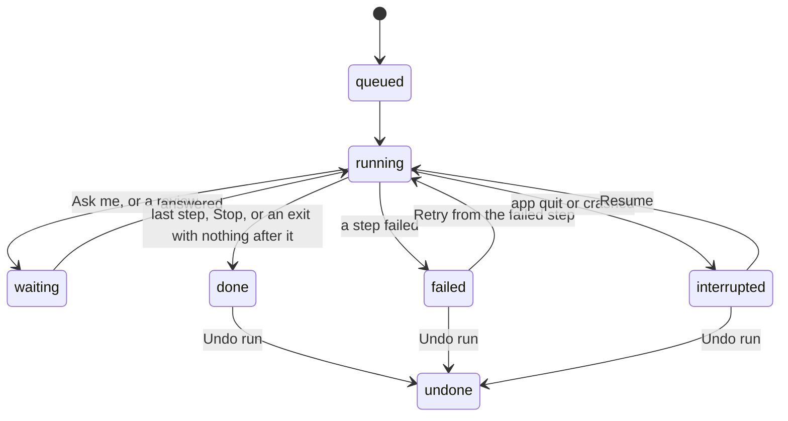

# Engine

How FolderFlow runs workflows. This is the plan the engine is built to, one pull request at a time (see Build order); each pull request updates the parts it builds. **Built so far:** pull requests 1 to 5, 8 and 9.

## Summary

The engine runs the workflows that are on. It watches their folders, fires their schedules, runs each step in order, pauses when a step needs the user, records every run, and can undo every change it made to a file. It is Rust, inside the app, in `src-tauri/src/engine/`. It replaces the Python scaffold that used to be in `engine/`.

It must hold the critical risks in `TESTING.md`: no lost files, nothing outside the granted folders, content only to the step's provider, nothing acted on without consent or on bad data, and every file processed once.

**In scope for the first version:** all 16 step types, the three triggers, run history, Needs you (questions, reviews, failed runs), undo per run, Try on a file, and running in the background while the window is closed.

**Out of scope for now:** running while the app is quit (Open at login covers restarts), a workflow started by another workflow's output, Pages and Numbers documents as AI input, sending images to models, and delete actions (there are none).

## Decisions

| # | Question | Decision | Why |
|---|---|---|---|
| 1 | Classify with no System 1 model set | Use the default LLM model instead, with the same constrained answer. `no_model` only when neither is set. The "Runs on" line says which is used. | Most people will connect one LLM and nothing else; Classify shouldn't block their first workflow. |
| 2 | Files already in the folder when a workflow is turned on | Leave them alone. Only files that arrive after it's on are run. Later, turning on can offer "Also run on the 14 files already there". | Turning on a workflow must never surprise-rename a folder full of old files. |
| 3 | The window is closed | Workflows keep running, with a menu bar icon (Open FolderFlow, Pause all, Quit). Quit stops them. | A file automation that stops when you close a window isn't one. |
| 4 | A run fails part way | Keep what was done; the run shows in Needs you with Retry from the failed step and Undo run. No automatic rollback. | Rolling back hides the problem and can fail too. The person decides. |
| 5 | The app quits or crashes mid-run | The run is marked interrupted and shows in Needs you with Resume and Undo. It isn't resumed on its own. | Resuming on its own could repeat an AI call or an action nobody asked for twice. |
| 6 | File steps after a Schedule trigger | Refused by validation for now (`needs_file`). A later version can give Schedule a folder to go through. | A scheduled run has no file to rename or move. |
| 7 | How long history is kept | The last 1,000 runs per workflow. Runs waiting for you, and their undo records, are never removed. | Enough to undo last month's mistakes; small on disk. |
| 8 | Workflows triggering each other | Never. Files FolderFlow writes don't start any workflow, not only their own. | Chains are a feature for later; loops are a disaster now. |
| 9 | Waiting for a file to finish being written | Don't. A file is taken as soon as a scan finds it; names browsers use while downloading, and empty files, are skipped. | File added is for downloads and files dragged in. Browsers download under a temporary name and rename when done, and a drag on the same disk is one rename. Waiting would add seconds to every run for a case these don't have. |

## Shape

The engine is a set of modules in `src-tauri/src/engine/`, each with one job. Only `files` touches the user's files, and only `models` talks to providers, so the two riskiest boundaries each live in one place.

| Module | Job |
|---|---|
| `engine` | Starts and stops everything. Holds the running workflows, reloads one when it's saved, applied, turned on or off, or deleted. Sends events to the window. |
| `intake` | Notices new files: which files count, and the record of files already seen. Folder watching itself is the `Watcher` port (FSEvents in `app.rs`). |
| `schedule` | Wakes up scheduled workflows at their time. |
| `runner` | Runs one run: follows the steps, fills in `{variables}`, calls the step, records the result. |
| `steps` | What each step type does, one function per type. |
| `files` | Every change to a user file: the granted-folder check, rename, move, copy, create, add row, tag, the undo journal, and undo. |
| `content` | Reads a file's text for AI steps: plain text, PDFs, scans and photos, Office documents. |
| `models` | Calls providers for Classify, Extract, Write and Agent steps, and checks what comes back. |
| `runs` | Stores runs, the Needs you list, and history retention. |

**Lifetime.** The engine starts in Tauri's `setup`, on Tauri's async runtime. Closing the window hides it; the app stays in the menu bar (decision 3, and Background). Quitting calls `Engine::stop`: see Failing, quitting, crashing.

**The running version only.** The engine reads a workflow's file, never its draft. The api layer tells it after `save_workflow`, `apply_draft`, `delete_workflow` and turning a workflow on or off, through a channel. It never re-reads files on a timer.

**Fakes for tests.** The boundaries sit behind traits in `engine/mod.rs` (`Clock`, `Notifier`, `EngineEvents`, `Trash`, `Watcher`, and later the model client). Tests tell the engine of folder changes themselves (`Engine::folders_changed`); `tests/app_watcher.rs` checks the real FSEvents watcher. Everything else is tested for real, in temporary folders: see `src-tauri/tests/engine_*.rs` and `tests/common/engine.rs`.

**Talking to the window.** New commands (see Api additions), plus two Tauri events: `run-changed` and `needs-you-changed`. The mock api implements both (`src/api/mockRuns.ts` runs the same steps the core can), so screens are built and tested against it.

## Triggers and intake

A file runs a workflow once, when it is complete, and never because FolderFlow itself put it there. Folder events are only a hint to look; what counts is a scan of the folder compared against the record of files already seen.

### File added

1. **Watch.** The `notify` crate (FSEvents on macOS) watches the trigger folder, and its subfolders when `subfolders` is on. The engine tells the watcher the full set of folders whenever a workflow is turned on or off.
2. **Scan.** After an event, wait one second for more, then list every watched folder the changed paths touch. A candidate is a regular file whose extension matches `fileTypes` (any case). Skipped: folders (with subfolders on, folders are looked inside, but not packages like `.pages` or `.app`), links, hidden files (a leading dot, or hidden in Finder), partial downloads (`.download`, `.crdownload`, `.part`, `.tmp`), Office lock files (`~$…`), and iCloud files that aren't downloaded yet.
3. **Take it.** No waiting for the file to stop changing (decision 9), with two exceptions, both left unrecorded so a later scan takes them: an empty file, and a file with `<its name>.part` or `.crdownload` beside it. Firefox puts an empty placeholder under the final name while it downloads into `.part`, then renames the finished file over it; taking the placeholder would run the workflow on nothing, then again on the real file (issue #27). Chrome and its relatives download under `.crdownload` and Safari inside a `.download` package, so their files appear only when finished. A large file copied in from another disk appears under its own name while it's still copying; Rename, Move and Tag still act on the right file, and steps that read its contents (pull requests 5 and 6) may need a check then.
4. **Once only.** Each workflow keeps a record of the files it has seen: device, inode, size, modification time and path, in `engine/seen/<workflow id>.jsonl`. A file whose device and inode are already there is skipped, even after it is renamed. A file copied in is a new file (new inode). A file is recorded before its run is queued, so a crash can lose a run but never repeat one. The record survives edits to the workflow and restarts, and is removed when the workflow is deleted.
5. **Queue a run.** One run per file, oldest first (by the time it landed in the folder), of the workflow as saved.

**Turning on.** When a workflow is turned on, every file already in its folder is recorded as seen without running (decision 2). Files that arrive while it is off are treated the same way when it's turned on again, and so are the files in a new folder, or of newly chosen types, when the trigger is changed. The record notes what was watched from when, so the engine can tell these apart from a restart. (The count of files left alone, for "Also run on the 14 files already there", comes later with the screen that offers it.)

**While the app was quit.** On start, each watched folder is scanned once. Files that arrived in the meantime and aren't in the record are run, oldest first.

**FolderFlow's own files.** Before any action puts a file somewhere (rename, move, copy, create file, add row, and undo putting one back), `files` tells intake the path. A scan passes over that path until the action is over, and then the file is recorded as seen for every workflow watching that folder (decision 8). If the app crashes in between, the journal's recovery at the next start names the path, and it is recorded then, before any folder is scanned.

### Schedule

The next time is worked out in the Mac's local time zone, so daylight saving changes are handled: a time the clocks skip runs when they land (2:30 on the spring-forward night runs at 3:00), and a time that happens twice runs the first time. If the Mac was asleep or FolderFlow was quit at that time, the workflow runs once when it's back, as long as that is within 12 hours. It never runs more than once to catch up. Turning a schedule on, or changing its time, doesn't run for times already past.

`engine/schedules.json` keeps, for each scheduled workflow that's on, the time up to which it has been checked, so a restart neither misses nor repeats a time. The engine checks at each due time, and at least once a minute to notice waking from sleep. A scheduled run gives `{date}` and `{year}`.

### Run now

The person chooses **Run…** in the editor's toolbar and picks one or more files (`choose_files`, from Rust like the other pickers). Each file gets its own run of the saved workflow (not a draft), whether the workflow is on or off; it works for Run now and File added workflows. Run now ignores the seen-files record, since the person asked for it.

Before anything is queued, every file is checked: it must exist and be a regular file, not a folder or a link. If any file fails, none runs. A workflow with problems is refused ("Fix the problem with this workflow before running it."), as is a scheduled one. For Run now, `{dateAdded}` is the day the run was queued.

Until a step type is built, a run that reaches it fails with "Write steps can't run in this version of FolderFlow yet.", before touching anything.

## Runs

A run is one pass of one workflow over one file (or one scheduled moment). It keeps a copy of the workflow as it was when the run started, so a run waiting for an answer finishes the way it began, even if the workflow is edited meanwhile.

### The run record

`runs/<workflow id>/<run id>.json` in the app's data folder (`engine/runs.rs`), written atomically when queued, after every step, and at the end. An unreadable record is skipped, never changed:

| Field | Holds |
|---|---|
| `id`, `workflowId`, `revision` | The run, and the workflow revision it ran |
| `workflow` | The copy of the workflow's steps it runs |
| `trigger` | `fileAdded`, `schedule` or `runNow`; the file's path and inode at the start |
| `status` | See below |
| `startedAt`, `endedAt` | When it was queued, and when it became done, failed or undone (RFC 3339, the Mac's offset) |
| `steps` | One entry per step reached: step id, title, type, times, outcome (`running`, `done`, `failed`), the branch taken, the values it produced, and a message. Later: the file actions it made (journal ids), the model used and whether content left the Mac |
| `values` | Every `{variable}` so far, with its kind |
| `waitingFor` | The question it is paused on, with its `{variables}` filled in (later, a review too) |
| `continueAt` | For a queued run carrying on after an answer, a retry or a resume: the step it starts from |
| `dismissed` | A failed or interrupted run the person took off Needs you; it stays in the history and can still be undone |
| `undo` | What Undo run put back and what it left alone |
| `error` | `{ stepId, message }`, key-free, when it failed |

### States

### Running the steps

The runner starts at the trigger and follows `next` or the branch the step chose. Before a step runs, every `{name}` in its fields is replaced by its value. Values have the kind their step gave them: text, number, date (`YYYY-MM-DD`) or yes/no.

In file names and folders, a value is made safe first: `/` and `:` become `-`, control characters become spaces, leading dots and spaces and trailing spaces are removed, and it's cut to 200 bytes. So a value can't add a folder level, climb out with `..` or hide the file. The text around the variables is kept as written. A value that ends up empty fails the step before anything moves ("{vendor} is empty, so it can't be used in a file or folder name."). This is `values::fill_name`.

The run keeps track of where its file is now (`file` in the run record), so a Move after a Rename moves the renamed file. Rename gives `{newName}` (the new name without its extension, numbered if it had to be) and Move gives `{newFolder}` (where the file or its copy went, with `~`). Each file step leaves a message in plain words: "Renamed Scan.pdf to 2026-09-14 Blue Bottle.pdf.", "Moved … to ~/Documents/Receipts/2026.", "Tagged … Screenshot and 2026.", "Added a row to Expenses.csv."

| Step | At run time | Fails when |
|---|---|---|
| `classify`, `extract`, `write`, `agent` | See AI steps | See AI steps |
| `rename`, `move`, `createFile`, `addRow`, `tag` | See File safety | See File safety |
| `notify` | Shows a macOS notification; clicking it opens the run | Never (a refused notification is logged) |
| `if` | Compares as numbers when both sides read as numbers, as dates when both read as dates, otherwise as text, ignoring case and outer spaces | Never |
| `askMe` | Pauses the run; the question goes to Needs you with a notification | Never |
| `stop` | Ends the run as done | Never |

### How many at once

Runs of one workflow go one at a time, in the order their files arrived, so two runs never race for the same name or the same spreadsheet. A run waiting for an answer steps out of the line. Different workflows run side by side. Model calls are limited per connection: one at a time for Ollama and custom servers, four for cloud providers.

### Failing, quitting, crashing

A failed step ends the run as failed and sends a notification (decision 4). Actions already made stay made. Retry runs again from the failed step with the same values.

Quitting stops watching and schedules, and nothing new starts; files that arrive afterwards aren't recorded, so the next start runs them. Runs still in the queue are marked interrupted at once. A run in progress stops after the step it is on, as interrupted, and resumes with the next one. Quitting waits up to two seconds for that; a run still going after that (a long copy, say) is marked interrupted as it stands, and the journal settles its last action at the next start.

A run found `queued` or `running` at start-up was cut off (decision 5). The journal says whether its last file action finished (see File safety). The run is marked interrupted and waits in Needs you. A waiting run stays waiting across restarts.

Resume carries on from the step that was cut off, which runs again; a run cut off between two steps carries on with the next one. Running a cut-off Rename, Move or Tag again changes nothing more, but a Copy, Create file or Add row that had finished before the quit happens a second time. The person chose Resume, and Undo run takes both back.

A run carrying on (after an answer, a retry or a resume) first checks that its file is still where it left it, by inode. If not, it fails with "Scan_0042.pdf was moved or deleted while the run was waiting."

## File safety

FolderFlow never deletes and never overwrites. Every change is written down before it happens, so it can be finished or reversed after a crash, and undone later.

### Granted folders

A workflow may only touch the folders it names. They're worked out when it's turned on:

- the folder the run's file is in (not the folders inside it);
- the trigger folder (and everything below it when `subfolders` is on);
- for each Move and Create file folder, the fixed part of the path before the folder holding the first `{variable}`, and below. `~/Documents/Paperwork/{category}` grants `~/Documents/Paperwork` and below;
- for each Add row file, its folder; with a variable in the path, the fixed part and below.

A path that starts with a variable, like Create file's `{newFolder}`, grants nothing of its own: where it leads must already be granted by another step. This is `Grants::for_run`, from the text alone (`workflow/paths.rs`), so validation and the engine agree.

Every path is checked just before use: `~` expanded, existing parts resolved through symlinks, `..` refused, and the result must sit inside a granted folder. The comparison ignores case on case-insensitive volumes (the APFS default). A variable's value can't add a folder level, because `/` is already replaced.

Some folders can never be granted, and validation says so (`folder_not_allowed`): `/`, your home folder itself, `~/Library` (which holds FolderFlow's own data folder), `/System` and `/Applications`, in any case. A path that isn't full (`~/…` or `/…`) or that uses `..` is `invalid_value`. The engine skips any such folder when granting, in case a workflow file skipped validation.

macOS asks for permission the first time an app opens Desktop, Documents or Downloads. If access is refused, the step fails with "FolderFlow isn't allowed to open Downloads. Allow it in System Settings › Privacy & Security › Files and Folders."

### What each action does

| Action | Does | Name taken | Undo |
|---|---|---|---|
| Rename | New name in the same folder; the extension stays | Adds " 2", " 3"… before the extension | Back to the old name |
| Move | Creates missing folders, then moves. Same disk: one atomic rename. Another disk: copy to a hidden temporary file beside the target, flush, rename into place, check the size, and only then remove the original. | Adds " 2" | Back to the old folder and name; folders it created are removed if empty |
| Copy | Like Move, keeping the original. A clone on APFS, so it's instant and takes no space. | Adds " 2" | The copy goes to the Trash |
| Create file | Writes a temporary file, then renames it into place | Adds " 2" | The file goes to the Trash |
| Add row | Reads the CSV, adds the row, writes it all to a temporary file and swaps it in, so a crash never leaves half a row. A new file (and its folder) is created, starting with the headings. The file's own line endings are kept, and an unfinished last line is finished. If the file changes between reading and swapping, it's read again (three tries). A spreadsheet that is a link is refused. | Not possible | The row is removed if the file is otherwise unchanged; if someone edited it since, the row stays and undo says so |
| Tag | Adds Finder tags it doesn't have (ignoring case), keeping the ones already there and their colours | Not possible | Removes only the tags it added |
| Notify | Shows a notification | Not possible | Nothing to undo |

"No overwrite" is enforced by the operating system, not by checking first: renames use `renamex_np` with `RENAME_EXCL`, which fails if the name exists, and new files are created with `O_EXCL`. There's no gap between checking and writing for another app to use.

CSV values that start with `=`, `+`, `-`, `@`, a tab or a carriage return get a leading `'`, so a spreadsheet never runs a formula that came from a document. Plain numbers like `-12.50` are left as they are.

Only the file being acted on, and only a regular file, is touched: a link is refused rather than followed. Access refused by macOS says which setting to change ("If it's in Desktop, Documents or Downloads, allow FolderFlow in System Settings › Privacy & Security › Files and Folders.").

### The journal

`engine/journal/<run id>.jsonl` in the data folder (`engine/files/journal.rs`). Each action writes an **intent** line before touching the disk and a **done** line after, each flushed to disk. The intent holds the paths before and after, the hidden temporary file (`.name.ffpart-…`) if it uses one, and, for Add row, a backup of the previous CSV (in `<run id>.backups/`) and the file's length once the row is in. The done line holds the inode, size and modification time the action left. Folders created on the way are actions of their own.

At start-up, an intent without a done line is checked against the disk: if the file is at the new place, the action is marked done, and if it's still at the old place, it's marked not done; temporary files are removed. A move to another disk writes a **placed** line once its copy is whole in place, so a crash after that finishes the move by removing the original. Either way nothing is lost, and the run becomes interrupted. This is `files::recover`, run before anything else starts.

### Undo

Undo is per run and reverses its actions newest first. Each one first checks that the file is still exactly as the run left it: same inode, size and modification time. A file that has changed since is left alone, and undo lists it ("Invoice 2026-044.pdf was changed after this run, so it wasn't moved back"). If the old name is taken by now, the file comes back with " 2". Undo is recorded in the run, and the run becomes `undone`.

Files FolderFlow made are moved to the Trash, never deleted, so even undo can be undone from Finder. Folders the run created are removed only if they're empty. Undo writes what it did to the journal too, so undoing twice reverses nothing more, and a file undo itself put back still counts as unchanged for the actions before it.

`Engine::undo_run` does this for a run that is done, failed or interrupted; the Undo button comes with the History page (pull request 4).

## AI steps

An AI step sends the file's text and the step's own instructions to one provider, the default for its kind, and nothing reaches a later step until the answer has been checked. Actions never see a value a model made up in the wrong shape.

### Reading the file

`content::read` (`engine/content/`) turns a file into text. It never fails: a file it can't read gives no text. It uses macOS's own frameworks from Rust, through `objc2`. From pull request 6, a run reads its file once and keeps the text for its other AI steps.

| Files | How |
|---|---|
| txt, md, csv, tsv, json, vtt, srt, log | Read as text: UTF-8, else Latin-1. A file with a NUL byte isn't text |
| html, htm | Tags, scripts, styles and comments dropped; entities decoded; a line per block |
| rtf | Control words and their groups (fonts, colours, pictures) dropped; paragraphs as lines; `\'hh` and `\uN` characters decoded |
| pdf | PDFKit's text, page by page. A page with fewer than 20 letters (a scan) is drawn at 144 dpi on white and read by Vision's text recognition, for at most 20 pages. A locked PDF gives no text |
| png, jpg, jpeg, heic, tif, tiff, gif | Turned upright by ImageIO, put on white (dark text on a transparent background reads as nothing otherwise), and read by Vision, top to bottom |
| docx | The paragraphs of `word/document.xml`, a line each |
| pptx | Each slide in order (1, 2 … 10), a line per paragraph, a blank line between slides |
| xlsx | Each sheet by name, in the workbook's order: a line per row, cells between tabs, shared strings looked up, formulas as their last value, TRUE/FALSE for yes/no |
| anything else, or nothing readable | No text. The model gets the file name only, and the step says so: "FolderFlow couldn't read any text in X, so the model was given only its name." |

Text is cut at 30,000 characters (about the first pages); the step says "X is long, so only its first 30,000 characters were read." Reading stops early rather than reading a whole huge file, and each part of an Office file is capped at 32 MB unpacked. Recognition runs on the Mac, so a local model keeps everything on the Mac.

The sample files in `src-tauri/tests/fixtures/content` are made with the Mac's own tools by `make.sh` there, and `tests/content.rs` checks each kind. Text recognition is compared word by word, since macOS versions may break lines differently.

### What is sent

The file name, its extension, the text, and the step's settings: categories and their descriptions, details and what to look for, the instruction. Nothing else: not other files, not the folder's contents, not earlier runs. It goes only to the connection that is the kind's default when the run starts, and the run records which one and whether it left the Mac. Prompts live in Rust with a version number, recorded in the run.

### Checking the answer

Models are asked for JSON in a fixed shape (tool use for Anthropic, `json_schema` for OpenAI-compatible servers, `format` for Ollama), and every answer is parsed strictly.

| Step | Accepted | Otherwise |
|---|---|---|
| Classify | Exactly one of the step's category ids | Asked once more; then the step fails |
| Extract | Every detail, in its kind. Numbers lose currency signs and thousands separators. Dates become `YYYY-MM-DD` (an ambiguous 03/04/2026 is read in the Mac's date order). Yes or no becomes `yes` or `no`. | A missing or unreadable detail follows `ifMissing`: **review** pauses the run in Needs you with the details filled in so far, to check and complete; **fail** fails the step |
| Write | Non-empty text, up to 20,000 characters | Fails |
| Agent | A final answer whose outputs pass the Extract checks | Review, like Extract |

### Classify and System 1

Classify uses the System 1 default. With none set, it uses the LLM default with the same fixed answer shape (decision 1).

### Agent steps

A loop of up to 8 turns. The model may call only the abilities the step allows. Today that is `readFile`, which returns the file's text a page at a time. It ends by calling `finish` with the outputs. It can't touch files; only later steps can.

### Errors and waiting

The provider's own reason is kept and shown on the step, without keys (issue #8): "Anthropic says your credit balance is too low", not "an answer FolderFlow couldn't read".

| Case | Then |
|---|---|
| Rate limited (429), server error (5xx), or no answer | Tried again after 2, 10 and 30 seconds; the step shows "Waiting for Anthropic" |
| Key rejected (401/403), no credit, model gone | Fails at once, with a link to Settings |
| Ollama or a custom server not running | Fails at once: "Ollama isn't running. Start it, then retry." |
| No answer within 2 minutes (5 for local models) | Treated as no answer |

Token counts are recorded per step when the provider reports them.

## Run history and Needs you

Every run is kept (decision 7), and anything that needs a person lands in one list, Needs you, with a notification.

### Needs you

| Item | Shows | Choices |
|---|---|---|
| Ask me | The question, with the file | One button per answer; the run continues down that branch |
| Review (pull request 6) | The details Extract or an Agent step found, as a form, with the missing or unreadable ones marked | Continue with the corrected details, or Stop the run |
| Failed run | The step, and the reason in plain words | Retry from that step, Undo run, or Dismiss |
| Interrupted run | Where it stopped | Resume, Undo run, or Dismiss |

Needs you is a section at the top of the Workflows page, shown while it has items; each item links to its run. The count in the sidebar and on each workflow's card is the number of these items: `WorkflowSummary.needsYou`. `WorkflowSummary.lastRun` is the workflow's newest run, as a `RunSummary`. The engine keeps both in memory, built from the run records at start, so listing workflows doesn't read every run.

A question sends a notification with the question. Answering a run that isn't waiting (answered in another window, or undone) is `conflict`; an answer that isn't one of the step's is `invalid`. The answer is recorded on the Ask me step ("You answered Log it."), and the run goes back to the end of its workflow's line. An answer whose branch leads nowhere ends the run as done. The screens refresh on `run-changed`, since every change to Needs you is a change to a run; there is no separate event.

### History

The History page lists runs newest first, 50 at a time, filtered by workflow or state. A run opens (`#/history/<run id>`) to its steps in plain words: "Renamed Scan_0042.pdf to 2026-09-14 Blue Bottle 4.50.pdf", "You answered Log it.", and "Went the Yes way." for a branch. Undo run is at the top, after a confirmation, and the page then says what was put back and lists each file left alone with the reason. A run that needs the person offers the same choices there as in Needs you. Later: each AI step says which model ran it and whether the file's text left the Mac.

Later: the editor opens a workflow's recent runs and highlights the path a run took on the canvas; clicking a notification opens its run.

### Notifications

Everything FolderFlow tells the person goes two ways: a macOS notification, and the list under the bell at the top right of the window (`engine/notices.rs`, kept in `engine/notifications.json`, the newest 200). The list is there even when macOS doesn't show a notification, as in development builds or with notifications turned off.

| Kind | When | Says |
|---|---|---|
| `question` | A run reaches Ask me | The question |
| `failed` | A run fails | "Rename it failed on README: …" |
| `message` | A Notify step | Its message |
| `undo` | Undo run left files alone | "Undo put back 2 of this run's changes. 1 file changed since, so it was left alone." |

The bell shows the unread count. Its panel lists them newest first; clicking one opens its run and marks it read, "Mark all as read" clears the count, and "Clear all" empties the list (runs stay in History). The `notices-changed` event (`onNoticesChanged`) carries the unread count whenever the list changes.

### Pause all

The title bar shows runs in progress: a spinner and "2 running". Hovered, it turns into a pause icon and "Pause all"; with nothing running, only the pause icon shows. Clicking pauses every workflow:

- New files wait. They aren't recorded as seen, so resuming looks in every watched folder at once and runs them.
- Scheduled times that pass while paused are skipped, not run later.
- Runs already queued or running finish, and Run now still works: the person asked for it.

Paused, the title bar shows an amber "Paused · Resume", and the Workflows page a banner saying what pausing does. The pause is kept in `engine/paused`, so it survives a restart. The menu bar's Pause all is the same pause, and the `activity-changed` event keeps the two in step.

Next to the bell, a sun or moon switches between light and dark: the same setting as Settings › Appearance, starting from what the Mac shows when that is set to System.

### Background

FolderFlow keeps running with its window closed (decision 3). This lives in `src-tauri/src/background.rs`, outside the engine.

- **Closing the window** (the red button or ⌘W) hides it and takes FolderFlow out of the Dock and ⌘-Tab. Workflows keep running.
- **The menu bar icon** is a folder with an arrow, or with a pause sign while paused, drawn as a template so it follows a light or dark menu bar. Its menu:

  | Line | Does |
  |---|---|
  | "2 running", "Nothing running", "Paused", or "Paused · 1 finishing" | Nothing; it says what the engine is doing |
  | "1 needs you", "3 need you" (only when some do) | Opens the window on Workflows, where Needs you is |
  | Open FolderFlow | Shows the window and puts FolderFlow back in the Dock |
  | Pause all, or Resume while paused | Pause all |
  | Quit FolderFlow (⌘Q) | Quits; see Failing, quitting, crashing |

  It follows `activity-changed`, which the engine sends when the pause, the count of runs in progress or the count in Needs you changes.
- **Opening FolderFlow again** from Finder or Spotlight while it's in the menu bar shows the window.
- **Open at login** is the `openAtLogin` setting, on by default. Saving it adds or removes a login item (a LaunchAgent, through the autostart plugin), and each start makes the login item match the setting. Only FolderFlow.app does this; a development build would add its bare binary, so it leaves the login item alone. Opened at login, FolderFlow starts in the menu bar with no window.

### Storage and retention

Runs live in `runs/<workflow id>/<run id>.json`, with their journals, in the app's data folder. After each run that ends done, a workflow's runs beyond the newest 1,000 are removed along with their journals and backups (`RunStore::prune`, `files::forget`); only then are they read, so a workflow under the limit costs a directory count. Runs that are queued, running, waiting, failed or interrupted are never removed. Later: deleting a workflow moves its runs to the trash with it.

## Try on a file

Try on a file runs the workflow as it stands in the editor on one chosen file, for real up to the point of changing anything, and shows what each step would do. It writes nothing, records nothing, shows no notification, and doesn't mark the file as seen. `Engine::try_on_file` runs the ordinary runner with `files::Plan` in place of `Files`.

- **What runs:** the editor's current version (the draft, for a workflow that's on), sent with the request, so unsaved edits are tried too. A scheduled workflow has no file, so it has no Try button.
- **AI steps run for real.** They are what's being tried. The Try button says where the text goes first: "Sends the file's text to Anthropic" or "Stays on this Mac". (With pull request 6; until then an AI step stops a try as it stops a run.)
- **Actions are worked out, not done:** "Would rename Receipt.pdf to 2026-09-14 Receipt.pdf.", "Would move … to ~/Documents/Receipts/2026 (the folder will be created).", "Would add the row 2026-09-14, Blue Bottle, 4.50 to Expenses.csv.", "Would show the notification "Filed Receipt".". `Plan` numbers names against the disk as the earlier steps would have left it ("…, as Invoice 2.pdf"), and applies the granted-folder, name and link checks of a real run, so those problems show up here first. It only reads the disk.
- **Ask me** appears inside the try, with its answers as buttons. A try keeps no state: answering tries again from the start with the answers so far (`answers`, by step id), which changes nothing since nothing was done. Reviews join this with pull request 6.
- **Where it shows:** a card over the right of the canvas, where the step settings go when no step is selected. It lists the steps in order with what each would do; each step's values open under it, and clicking its title selects it. Each step card gets a chip (Tried, Waiting for your answer, Stopped here), and the path taken is drawn in green. The card says when the workflow has changed since the try.
- **Problems:** a try stops at the first step on its path that has a problem, and names it. Problems on paths it doesn't take don't stop it. A problem with the whole workflow (no trigger) refuses the try.
- **Progress:** a try without AI steps is instant, so there are no `try-step` events yet; they come with the AI steps, which take seconds.

## Api additions

These join `docs/api-contract.md`, with Rust types exported through ts-rs and checked by `contract.check.ts`. The mock implements every one.

| Api method | Command | Returns |
|---|---|---|
| `listRuns(query?)`: `{ workflowId?, status?, before?, limit? }`; `before` is a run id, `limit` defaults to 100 | `list_runs` | `RunSummary[]`, newest first |
| `getRun(id)` | `get_run` | `Run` |
| `listNeedsYou()` | `list_needs_you` | `NeedsYouItem[]`: `{ kind: "question" \| "failed" \| "interrupted", run: RunSummary, step, message, answers }`, newest first |
| `answer(runId, branchId)` | `answer` | `Run` |
| `submitReview(runId, values)` | `submit_review` | `Run`, or `invalid` if a value still doesn't fit its kind |
| `retryRun(runId)` / `resumeRun(runId)` | `retry_run` / `resume_run` | `Run` |
| `undoRun(runId)` | `undo_run` | `{ run, restored, leftAlone: [{ path, reason }] }` |
| `dismissRun(runId)` | `dismiss_run` | nothing; `conflict` unless the run is failed or interrupted |
| `chooseFiles(start?)` | `choose_files` | `string[]`, with `~` for the home folder (empty when cancelled) |
| `runNow(workflowId, files)` | `run_now` | `RunSummary[]`, queued |
| `tryOnFile(workflow, file, answers?)` | `try_on_file` | `TryResult`: `{ status: "done" \| "waiting" \| "failed", steps: StepRun[], values, question, error }` |
| `pauseAll(paused)` | `pause_all` | `Activity`: `{ paused, running, needsYou }` |
| `getActivity()` | `get_activity` | `Activity` |
| `listNotices()` | `list_notices` | `Notice[]`, newest first |
| `markNoticesRead(ids?)` | `mark_notices_read` | nothing; all of them when `ids` is left out |
| `clearNotices()` | `clear_notices` | nothing; runs and their history are untouched |

Turning a workflow on stays a save with `enabled: true`; the engine hears of it from the command. Later, with the screen that offers to run on them, the result gains `alreadyThere: number`, the files recorded as seen without running.

**Events:** `run-changed` `{ runId, workflowId, status }`, `notices-changed` with the unread count, `activity-changed` with the `Activity` (`onActivityChanged`), and `navigate` with a page's `#/…` address when the menu bar opens one (`onNavigate`). Screens refresh from the commands; events only say when. The Api has `onRunChanged(listener)`, which returns a function that stops listening. Needs you needs no event of its own (see Needs you).

**Errors:** runs use the existing codes. `not_found` is an unknown run, `conflict` is answering a run that isn't waiting (answered in another window, or undone), and `invalid` is an answer that isn't one of the step's branches.

## Tests

Each critical risk in `TESTING.md` gets its engine tests before the code that could break it, on real files in temporary folders, with fakes only for the clock, models, folder events and notifications.

| Risk | Engine tests |
|---|---|
| Losing or corrupting files | Every action with a name clash keeps both files. A crash injected between intent and done, for every action, leaves the original intact and start-up reconciles it. Cross-disk move removes the original only after the copy checks out. Property test: random sequences of actions over a random tree, then undo, gives back the exact tree (names, places, contents, tags). Undo leaves alone a file changed after the run, and says so. |
| Acting outside the granted folders | `..`, symlinks out of the folder, absolute paths in variables, `/` and `:` in values, different case, and `~/Library` are refused before touching the disk. A symlink swapped in after the check is still refused (the check resolves at use). |
| Sending files to the wrong place | With a local model as default, a run makes no request except to that local address (the fake records every request). Changing the default changes where the next run's text goes, and a running run keeps its own. The text sent contains nothing from other files. |
| Leaking keys | Provider errors, run records, journals, logs and events never contain a known key string. |
| Acting on bad data | The scripted fake model returns a wrong category, a missing detail, a malformed number or date, empty text, invalid JSON, a refusal, and a timeout: none reaches Rename, Move or Add row. Review pauses the run; fail ends it. |
| Acting without consent | A run at Ask me does nothing until answered; answering twice gives `conflict`; the other answer's branch never runs. Review won't continue with a missing detail. |
| Running away | Partial downloads, lock files, hidden files and links aren't taken. The same file isn't run twice, including after renaming it and after a restart. Files FolderFlow writes into any watched folder start nothing, including into the workflow's own folder, after undo, and after a crash mid-write. Files already there when a workflow is turned on aren't run. Schedule catches up once, not per missed time. |

Also: the runner against every template (with the fake model) to check each one runs end to end; variables at run time match `availableAt`; one api behaviour suite for the mock and the real engine, as for workflows today.

Model quality (does a real model pick the right category?) is the separate eval suite, never a merge gate.

## Build order

Nine pull requests, each usable on its own and each test-first. File safety comes before anything that moves a real file, and model calls come after the steps that don't need them work end to end. Pull requests 9 and 8 come before 6 and 7, so a first release can ship the workflows without AI steps; the numbers stay as they were.

| # | Pull request | Done when |
|---|---|---|
| 1 ✓ | Engine skeleton: delete `engine/`, add the modules, run records, the runner with If, Stop and Notify, and Run now | A Run now workflow of If and Notify runs, and its run can be read back |
| 2 ✓ | `files`: granted folders, the six actions, the journal, crash reconciling, undo | The file-safety and outside-the-folder tests pass, property test included |
| 3 ✓ | Intake and schedules: watching, the seen record, own writes, catching up | The running-away tests pass; the Screenshots template works on a real folder |
| 4 ✓ | History and Needs you screens, Ask me, notifications; real `lastRun` and `needsYou` | A person can answer a question and undo a run from the app |
| 5 ✓ | `content`: text, PDFKit, Vision, docx/pptx/xlsx | Sample files of each kind give the expected text |
| 9 ✓ | Background: menu bar, Pause all, Open at login (the autostart plugin) | Workflows keep running with the window closed, and after a restart |
| 8 ✓ | Try on a file | The Try button works in the editor, and nothing on disk changes |
| 6 | `models`: Classify, Extract and Write, answer checking, review, errors (closes #8), decision 1 | The bad-data and wrong-place tests pass with the fake model; Sort receipts runs on Ollama |
| 7 | Agent steps | The contract part of Paperwork inbox runs |

Pull request 1 added only the modules it needed (`engine`, `runs`, `runner`, `values`, and `app` for the app's notifications, events and Trash); pull request 2 added `files`. Each later one adds its own.
