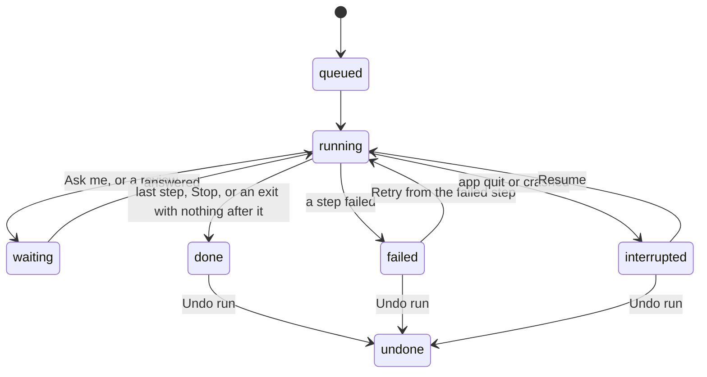

# Engine

How FolderFlow runs workflows. This is the plan the engine is built to, one pull request at a time (see Build order); each pull request updates the parts it builds. **Built so far:** pull request 1.

## Summary

The engine runs the workflows that are on. It watches their folders, fires their schedules, runs each step in order, pauses when a step needs the user, records every run, and can undo every change it made to a file. It is Rust, inside the app, in `src-tauri/src/engine/`. It replaces the Python scaffold that used to be in `engine/`.

It must hold the critical risks in `TESTING.md`: no lost files, nothing outside the granted folders, content only to the step's provider, nothing acted on without consent or on bad data, and every file processed once.

**In scope for the first version:** all 16 step types, the three triggers, run history, Needs you (questions, reviews, failed runs), undo per run, Try on a file, and running in the background while the window is closed.

**Out of scope for now:** running while the app is quit (Open at login covers restarts), a workflow started by another workflow's output, Pages and Numbers documents as AI input, sending images to models, and delete actions (there are none).

## Decisions

| # | Question | Decision | Why |
|---|---|---|---|
| 1 | Classify with no System 1 model set | Use the default LLM model instead, with the same constrained answer. `no_model` only when neither is set. The "Runs on" line says which is used. | Most people will connect one LLM and nothing else; Classify shouldn't block their first workflow. |
| 2 | Files already in the folder when a workflow is turned on | Leave them alone. Only files that arrive after it's on are run. Later, turning on can offer "Also run on the 14 files already there". | Turning on a workflow must never surprise-rename a folder full of old files. |
| 3 | The window is closed | Workflows keep running, with a menu bar icon (Open FolderFlow, Pause all, Quit). Quit stops them. | A file automation that stops when you close a window isn't one. |
| 4 | A run fails part way | Keep what was done; the run shows in Needs you with Retry from the failed step and Undo run. No automatic rollback. | Rolling back hides the problem and can fail too. The person decides. |
| 5 | The app quits or crashes mid-run | The run is marked interrupted and shows in Needs you with Resume and Undo. It isn't resumed on its own. | Resuming on its own could repeat an AI call or an action nobody asked for twice. |
| 6 | File steps after a Schedule trigger | Refused by validation for now (`needs_file`). A later version can give Schedule a folder to go through. | A scheduled run has no file to rename or move. |
| 7 | How long history is kept | The last 1,000 runs per workflow. Runs waiting for you, and their undo records, are never removed. | Enough to undo last month's mistakes; small on disk. |
| 8 | Workflows triggering each other | Never. Files FolderFlow writes don't start any workflow, not only their own. | Chains are a feature for later; loops are a disaster now. |

## Shape

The engine is a set of modules in `src-tauri/src/engine/`, each with one job. Only `files` touches the user's files, and only `models` talks to providers, so the two riskiest boundaries each live in one place.

| Module | Job |
|---|---|
| `engine` | Starts and stops everything. Holds the running workflows, reloads one when it's saved, applied, turned on or off, or deleted. Sends events to the window. |
| `intake` | Notices new files: folder watching, waiting until a file is complete, the record of files already seen. |
| `schedule` | Wakes up scheduled workflows at their time. |
| `runner` | Runs one run: follows the steps, fills in `{variables}`, calls the step, records the result. |
| `steps` | What each step type does, one function per type. |
| `files` | Every change to a user file: the granted-folder check, rename, move, copy, create, add row, tag, the undo journal, and undo. |
| `content` | Reads a file's text for AI steps: plain text, PDFs, scans and photos, Office documents. |
| `models` | Calls providers for Classify, Extract, Write and Agent steps, and checks what comes back. |
| `runs` | Stores runs, the Needs you list, and history retention. |

**Lifetime.** The engine starts in Tauri's `setup`, on Tauri's async runtime. Closing the window hides it; the app stays in the menu bar (decision 3). Quitting stops intake and schedules and marks running runs interrupted.

**The running version only.** The engine reads a workflow's file, never its draft. The api layer tells it after `save_workflow`, `apply_draft`, `delete_workflow` and turning a workflow on or off, through a channel. It never re-reads files on a timer.

**Fakes for tests.** The boundaries sit behind traits in `engine/mod.rs` (`Clock`, `Notifier`, `EngineEvents`, and later the model client and folder-change events). Everything else is tested for real, in temporary folders: see `src-tauri/tests/engine_*.rs` and `tests/common/engine.rs`.

**Talking to the window.** New commands (see Api additions), plus two Tauri events: `run-changed` and `needs-you-changed`. The mock api implements both (`src/api/mockRuns.ts` runs the same steps the core can), so screens are built and tested against it.

## Triggers and intake

A file runs a workflow once, when it is complete, and never because FolderFlow itself put it there. Folder events are only a hint to look; what counts is a scan of the folder compared against the record of files already seen.

### File added

1. **Watch.** The `notify` crate (FSEvents on macOS) watches the trigger folder, and its subfolders when `subfolders` is on.
2. **Scan.** After an event, wait one second for more, then list the folder. A candidate is a regular file whose extension matches `fileTypes`. Skipped: folders (including packages like `.pages`), symlinks, hidden files, `.DS_Store`, partial downloads (`.download`, `.crdownload`, `.part`, `.tmp`), Office lock files (`~$…`), and iCloud files that aren't downloaded yet.
3. **Wait until complete.** A candidate is taken when its size and modification time haven't changed for 2 seconds and it opens for reading. A file still being written is checked again on the next scan.
4. **Once only.** Each workflow keeps a record of the files it has seen: device, inode, size, modification time and path, in `engine/seen/<workflow id>.jsonl`. A file whose inode is already there is skipped, even after it is renamed. A file copied in is a new file (new inode). The record survives edits to the workflow and restarts.
5. **Queue a run.** One run per file.

**Turning on.** When a workflow is turned on, every file already in its folder is recorded as seen without running (decision 2). Files that arrive while it is off are treated the same way when it's turned on again.

**While the app was quit.** On start, each folder is scanned once. Files that arrived in the meantime and aren't in the record are run, in the order they were added.

**FolderFlow's own files.** Before any write, `files` registers the path it is about to create. Events for that path are dropped, and the file is recorded as seen for every workflow watching that folder (decision 8).

### Schedule

The next time is worked out in the Mac's local time zone, so daylight saving changes are handled. If the Mac was asleep or FolderFlow was quit at that time, the workflow runs once when it's back, as long as that is within 12 hours. It never runs more than once to catch up.

### Run now

The person chooses **Run…** in the editor's toolbar and picks one or more files (`choose_files`, from Rust like the other pickers). Each file gets its own run of the saved workflow (not a draft), whether the workflow is on or off; it works for Run now and File added workflows. Run now ignores the seen-files record, since the person asked for it.

Before anything is queued, every file is checked: it must exist and be a regular file, not a folder or a link. If any file fails, none runs. A workflow with problems is refused ("Fix the problem with this workflow before running it."), as is a scheduled one. For Run now, `{dateAdded}` is the day the run was queued.

Until a step type is built, a run that reaches it fails with "Rename steps can't run in this version of FolderFlow yet.", before touching anything.

## Runs

A run is one pass of one workflow over one file (or one scheduled moment). It keeps a copy of the workflow as it was when the run started, so a run waiting for an answer finishes the way it began, even if the workflow is edited meanwhile.

### The run record

`runs/<workflow id>/<run id>.json` in the app's data folder (`engine/runs.rs`), written atomically when queued, after every step, and at the end. An unreadable record is skipped, never changed:

| Field | Holds |
|---|---|
| `id`, `workflowId`, `revision` | The run, and the workflow revision it ran |
| `workflow` | The copy of the workflow's steps it runs |
| `trigger` | `fileAdded`, `schedule` or `runNow`; the file's path and inode at the start |
| `status` | See below |
| `startedAt`, `endedAt` | When it was queued, and when it became done, failed or undone (RFC 3339, the Mac's offset) |
| `steps` | One entry per step reached: step id, title, type, times, outcome (`running`, `done`, `failed`), the branch taken, the values it produced, and a message. Later: the file actions it made (journal ids), the model used and whether content left the Mac |
| `values` | Every `{variable}` so far, with its kind |
| `waitingFor` | The question or review it is paused on |
| `error` | `{ stepId, message }`, key-free, when it failed |

### States

### Running the steps

The runner starts at the trigger and follows `next` or the branch the step chose. Before a step runs, every `{name}` in its fields is replaced by its value. Values have the kind their step gave them: text, number, date (`YYYY-MM-DD`) or yes/no.

In file names and folders, a value is made safe first: `/` and `:` become `-`, leading dots and spaces are removed, and it's cut to 200 bytes. A value that ends up empty fails the step ("{vendor} was empty, so the new name would be empty").

| Step | At run time | Fails when |
|---|---|---|
| `classify`, `extract`, `write`, `agent` | See AI steps | See AI steps |
| `rename`, `move`, `createFile`, `addRow`, `tag` | See File safety | See File safety |
| `notify` | Shows a macOS notification; clicking it opens the run | Never (a refused notification is logged) |
| `if` | Compares as numbers when both sides read as numbers, as dates when both read as dates, otherwise as text, ignoring case and outer spaces | Never |
| `askMe` | Pauses the run; the question goes to Needs you with a notification | Never |
| `stop` | Ends the run as done | Never |

### How many at once

Runs of one workflow go one at a time, in the order their files arrived, so two runs never race for the same name or the same spreadsheet. A run waiting for an answer steps out of the line. Different workflows run side by side. Model calls are limited per connection: one at a time for Ollama and custom servers, four for cloud providers.

### Failing, quitting, crashing

A failed step ends the run as failed and sends a notification (decision 4). Actions already made stay made. Retry runs again from the failed step with the same values.

A run found `queued` or `running` at start-up was cut off (decision 5). The journal says whether its last file action finished (see File safety). The run is marked interrupted and waits in Needs you.

A paused or retried run first checks that its file is still where it left it, by inode. If not, it fails with "Scan_0042.pdf was moved or deleted while the run was waiting".

## File safety

FolderFlow never deletes and never overwrites. Every change is written down before it happens, so it can be finished or reversed after a crash, and undone later.

### Granted folders

A workflow may only touch the folders it names. They're worked out when it's turned on:

- the trigger folder (and everything below it when `subfolders` is on);
- for each Move and Create file folder, and each Add row file, the fixed part of the path before the first `{variable}`. `~/Documents/Paperwork/{category}` grants `~/Documents/Paperwork` and below.

Every path is checked just before use: `~` expanded, existing parts resolved through symlinks, `..` refused, and the result must sit inside a granted folder. The comparison ignores case on case-insensitive volumes (the APFS default). A variable's value can't add a folder level, because `/` is already replaced.

Some folders can never be granted, and validation says so (`folder_not_allowed`): `/`, your home folder itself, `~/Library`, `/System`, `/Applications`, and FolderFlow's own data folder.

macOS asks for permission the first time an app opens Desktop, Documents or Downloads. If access is refused, the step fails with "FolderFlow isn't allowed to open Downloads. Allow it in System Settings › Privacy & Security › Files and Folders."

### What each action does

| Action | Does | Name taken | Undo |
|---|---|---|---|
| Rename | New name in the same folder; the extension stays | Adds " 2", " 3"… before the extension | Back to the old name |
| Move | Creates missing folders, then moves. Same disk: one atomic rename. Another disk: copy to a hidden temporary file beside the target, flush, rename into place, check the size, and only then remove the original. | Adds " 2" | Back to the old folder and name; folders it created are removed if empty |
| Copy | Like Move, keeping the original. A clone on APFS, so it's instant and takes no space. | Adds " 2" | The copy goes to the Trash |
| Create file | Writes a temporary file, then renames it into place | Adds " 2" | The file goes to the Trash |
| Add row | Reads the CSV, adds the row, writes it all to a temporary file and swaps it in, so a crash never leaves half a row. A new file starts with the headings. | Not possible | The row is removed if the file is otherwise unchanged; if someone edited it since, the row stays and undo says so |
| Tag | Adds Finder tags, keeping the ones already there | Not possible | Removes only the tags it added |
| Notify | Shows a notification | Not possible | Nothing to undo |

"No overwrite" is enforced by the operating system, not by checking first: renames use `renamex_np` with `RENAME_EXCL`, which fails if the name exists, and new files are created with `O_EXCL`. There's no gap between checking and writing for another app to use.

CSV values that start with `=`, `+`, `-` or `@` get a leading `'`, so a spreadsheet never runs a formula that came from a document.

### The journal

`engine/journal/<run id>.jsonl`. Each action writes an **intent** line before touching the disk and a **done** line after. Each line holds the paths before and after, the inode, size and modification time, and, for Add row, the path of a backup of the previous CSV.

At start-up, an intent without a done line is checked against the disk: if the file is at the new place, the action is marked done, and if it's still at the old place, it's marked not done. Either way nothing is lost, and the run becomes interrupted.

### Undo

Undo is per run and reverses its actions newest first. Each one first checks that the file is still exactly as the run left it: same inode, size and modification time. A file that has changed since is left alone, and undo lists it ("Invoice 2026-044.pdf was changed after this run, so it wasn't moved back"). If the old name is taken by now, the file comes back with " 2". Undo is recorded in the run, and the run becomes `undone`.

Files FolderFlow made are moved to the Trash, never deleted, so even undo can be undone from Finder.

## AI steps

An AI step sends the file's text and the step's own instructions to one provider, the default for its kind, and nothing reaches a later step until the answer has been checked. Actions never see a value a model made up in the wrong shape.

### Reading the file

`content` turns a file into text once per run and keeps it for the run's other AI steps. It uses macOS's own frameworks from Rust, through `objc2`.

| Files | How |
|---|---|
| txt, md, csv, json, vtt, srt, html, rtf | Read as text (UTF-8, else Latin-1); markup stripped |
| pdf | PDFKit's text. Pages with almost no text (a scan) are drawn to an image and read by Vision's text recognition |
| png, jpg, jpeg, heic, tiff, gif | Vision's text recognition |
| docx, pptx | The text inside the document's XML |
| xlsx | Cell values, sheet by sheet |
| anything else, or nothing readable | No text. The model gets the file name only, and the run says so on the step |

Text is cut at about 30,000 characters (the first pages), and the step notes that it was cut. Recognition runs on the Mac, so a local model keeps everything on the Mac.

### What is sent

The file name, its extension, the text, and the step's settings: categories and their descriptions, details and what to look for, the instruction. Nothing else: not other files, not the folder's contents, not earlier runs. It goes only to the connection that is the kind's default when the run starts, and the run records which one and whether it left the Mac. Prompts live in Rust with a version number, recorded in the run.

### Checking the answer

Models are asked for JSON in a fixed shape (tool use for Anthropic, `json_schema` for OpenAI-compatible servers, `format` for Ollama), and every answer is parsed strictly.

| Step | Accepted | Otherwise |
|---|---|---|
| Classify | Exactly one of the step's category ids | Asked once more; then the step fails |
| Extract | Every detail, in its kind. Numbers lose currency signs and thousands separators. Dates become `YYYY-MM-DD` (an ambiguous 03/04/2026 is read in the Mac's date order). Yes or no becomes `yes` or `no`. | A missing or unreadable detail follows `ifMissing`: **review** pauses the run in Needs you with the details filled in so far, to check and complete; **fail** fails the step |
| Write | Non-empty text, up to 20,000 characters | Fails |
| Agent | A final answer whose outputs pass the Extract checks | Review, like Extract |

### Classify and System 1

Classify uses the System 1 default. With none set, it uses the LLM default with the same fixed answer shape (decision 1).

### Agent steps

A loop of up to 8 turns. The model may call only the abilities the step allows. Today that is `readFile`, which returns the file's text a page at a time. It ends by calling `finish` with the outputs. It can't touch files; only later steps can.

### Errors and waiting

The provider's own reason is kept and shown on the step, without keys (issue #8): "Anthropic says your credit balance is too low", not "an answer FolderFlow couldn't read".

| Case | Then |
|---|---|
| Rate limited (429), server error (5xx), or no answer | Tried again after 2, 10 and 30 seconds; the step shows "Waiting for Anthropic" |
| Key rejected (401/403), no credit, model gone | Fails at once, with a link to Settings |
| Ollama or a custom server not running | Fails at once: "Ollama isn't running. Start it, then retry." |
| No answer within 2 minutes (5 for local models) | Treated as no answer |

Token counts are recorded per step when the provider reports them.

## Run history and Needs you

Every run is kept (decision 7), and anything that needs a person lands in one list, Needs you, with a notification.

### Needs you

| Item | Shows | Choices |
|---|---|---|
| Ask me | The question, with the file | One button per answer; the run continues down that branch |
| Review | The details Extract or an Agent step found, as a form, with the missing or unreadable ones marked | Continue with the corrected details, or Stop the run |
| Failed run | The step, and the reason in plain words | Retry from that step, Undo run, or Dismiss |
| Interrupted run | Where it stopped | Resume, Undo run, or Dismiss |

The count on the Workflows page and in the sidebar is the number of these items. `WorkflowSummary.needsYou` and `lastRun` become real.

### History

The History page lists runs newest first, filtered by workflow or state. A run opens to its steps in plain words: "Renamed Scan_0042.pdf to 2026-09-14 Blue Bottle 4.50.pdf", "Asked 'Log Acme 1,200?' You answered Log it". Each AI step says which model ran it and whether the file's text left the Mac. Undo run is at the top.

The editor can open a workflow's recent runs and highlight the path a run took on the canvas.

### Storage and retention

Runs live in `runs/<workflow id>/<run id>.json`, with their journals, in the app's data folder. After each run, a workflow's runs beyond the newest 1,000 are removed along with their journals and backups. Runs that are waiting, failed or interrupted are never removed. Deleting a workflow moves its runs to the trash with it.

## Try on a file

Try on a file runs the workflow as it stands in the editor on one chosen file, for real up to the point of changing anything, and shows what each step would do. It writes nothing, records nothing, and doesn't mark the file as seen.

- **What runs:** the editor's current version (the draft, for a workflow that's on).
- **AI steps run for real.** They are what's being tried. The Try button says where the text goes first: "Sends the file's text to Anthropic" or "Stays on this Mac".
- **Actions are worked out, not done:** "Would rename to 2026-09-14 Blue Bottle 4.50.pdf", "Would move to ~/Documents/Receipts/2026 (the folder will be created)", "Would add a row to Expenses.csv: 2026-09-14, Blue Bottle, 4.50". Name clashes and granted-folder checks are applied as in a real run, so those problems show up here first.
- **Ask me and reviews** appear inside the try; answering continues it.
- **Where it shows:** each step card gets a result chip, the path taken is highlighted, and a panel lists the steps in order. Clicking a step shows its values.
- **Problems:** a try stops at the first step on its path that has a problem, and names it. Problems on paths it doesn't take don't stop it.

## Api additions

These join `docs/api-contract.md`, with Rust types exported through ts-rs and checked by `contract.check.ts`. The mock implements every one.

| Api method | Command | Returns |
|---|---|---|
| `listRuns(query?)`: `{ workflowId?, status?, before?, limit? }`; `before` is a run id, `limit` defaults to 100 | `list_runs` | `RunSummary[]`, newest first |
| `getRun(id)` | `get_run` | `Run` |
| `listNeedsYou()` | `list_needs_you` | `NeedsYouItem[]` |
| `answer(runId, branchId)` | `answer` | `Run` |
| `submitReview(runId, values)` | `submit_review` | `Run`, or `invalid` if a value still doesn't fit its kind |
| `retryRun(runId)` / `resumeRun(runId)` | `retry_run` / `resume_run` | `Run` |
| `undoRun(runId)` | `undo_run` | `{ run, restored, leftAlone: [{ path, reason }] }` |
| `dismissRun(runId)` | `dismiss_run` | nothing |
| `chooseFiles(start?)` | `choose_files` | `string[]`, with `~` for the home folder (empty when cancelled) |
| `runNow(workflowId, files)` | `run_now` | `RunSummary[]`, queued |
| `tryOnFile(workflow, file)` | `try_on_file` | `TryResult`; progress arrives as `try-step` events |
| `pauseAll(paused)` | `pause_all` | nothing |

Turning a workflow on stays a save with `enabled: true`. The result gains `alreadyThere: number`, the files recorded as seen without running.

**Events:** `run-changed` `{ runId, workflowId, status }` and `needs-you-changed` `{ count }`. Screens refresh from the commands; events only say when. The Api has `onRunChanged(listener)`, which returns a function that stops listening.

**Errors:** runs use the existing codes. `not_found` is an unknown run, `conflict` is answering a run that isn't waiting (answered in another window, or undone), and `invalid` is an answer that isn't one of the step's branches.

## Tests

Each critical risk in `TESTING.md` gets its engine tests before the code that could break it, on real files in temporary folders, with fakes only for the clock, models, folder events and notifications.

| Risk | Engine tests |
|---|---|
| Losing or corrupting files | Every action with a name clash keeps both files. A crash injected between intent and done, for every action, leaves the original intact and start-up reconciles it. Cross-disk move removes the original only after the copy checks out. Property test: random sequences of actions over a random tree, then undo, gives back the exact tree (names, places, contents, tags). Undo leaves alone a file changed after the run, and says so. |
| Acting outside the granted folders | `..`, symlinks out of the folder, absolute paths in variables, `/` and `:` in values, different case, and `~/Library` are refused before touching the disk. A symlink swapped in after the check is still refused (the check resolves at use). |
| Sending files to the wrong place | With a local model as default, a run makes no request except to that local address (the fake records every request). Changing the default changes where the next run's text goes, and a running run keeps its own. The text sent contains nothing from other files. |
| Leaking keys | Provider errors, run records, journals, logs and events never contain a known key string. |
| Acting on bad data | The scripted fake model returns a wrong category, a missing detail, a malformed number or date, empty text, invalid JSON, a refusal, and a timeout: none reaches Rename, Move or Add row. Review pauses the run; fail ends it. |
| Acting without consent | A run at Ask me does nothing until answered; answering twice gives `conflict`; the other answer's branch never runs. Review won't continue with a missing detail. |
| Running away | A file being written (growing over time) isn't taken until still. The same file isn't run twice, including after renaming it and after a restart. Files FolderFlow writes into any watched folder start nothing. Files already there when a workflow is turned on aren't run. Schedule catches up once, not per missed time. |

Also: the runner against every template (with the fake model) to check each one runs end to end; variables at run time match `availableAt`; one api behaviour suite for the mock and the real engine, as for workflows today.

Model quality (does a real model pick the right category?) is the separate eval suite, never a merge gate.

## Build order

Nine pull requests, each usable on its own and each test-first. File safety comes before anything that moves a real file, and model calls come after the steps that don't need them work end to end.

| # | Pull request | Done when |
|---|---|---|
| 1 ✓ | Engine skeleton: delete `engine/`, add the modules, run records, the runner with If, Stop and Notify, and Run now | A Run now workflow of If and Notify runs, and its run can be read back |
| 2 | `files`: granted folders, the six actions, the journal, crash reconciling, undo | The file-safety and outside-the-folder tests pass, property test included |
| 3 | Intake and schedules: watching, waiting until complete, the seen record, own writes, catching up | The running-away tests pass; the Screenshots template works on a real folder |
| 4 | History and Needs you screens, Ask me, notifications; real `lastRun` and `needsYou` | A person can answer a question and undo a run from the app |
| 5 | `content`: text, PDFKit, Vision, docx/pptx/xlsx | Sample files of each kind give the expected text |
| 6 | `models`: Classify, Extract and Write, answer checking, review, errors (closes #8), decision 1 | The bad-data and wrong-place tests pass with the fake model; Sort receipts runs on Ollama |
| 7 | Agent steps | The contract part of Paperwork inbox runs |
| 8 | Try on a file | The Try button works in the editor, and nothing on disk changes |
| 9 | Background: menu bar, Pause all, Open at login (the autostart plugin) | Workflows keep running with the window closed, and after a restart |

Pull request 1 added only the modules it needed (`engine`, `runs`, `runner`, `values`, and `app` for the app's notifications and events); each later one adds its own.
